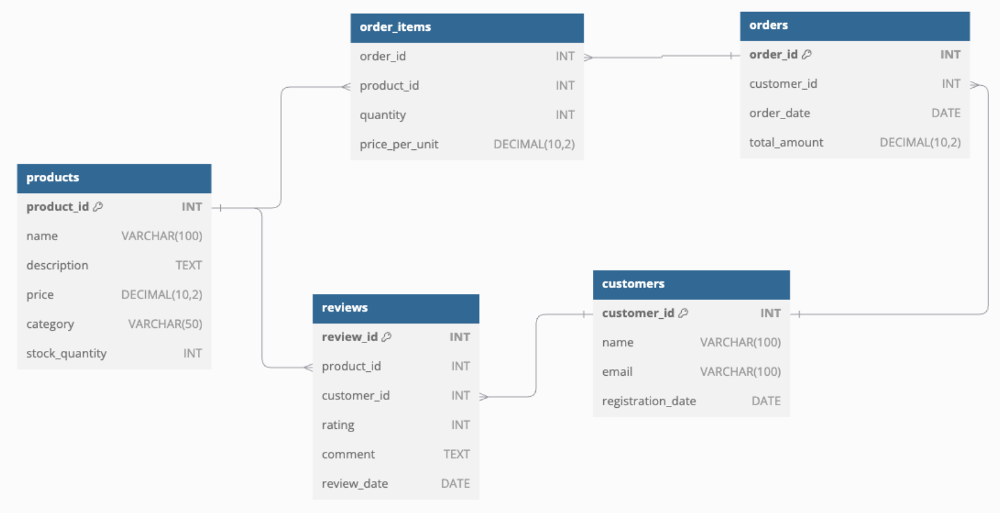

# Part 3 - Database design:



### Query Optimization:

#### Optimize the following query that retrieves the top 10 best-selling products:

```
SELECT p.product_id, p.name, SUM(oi.quantity) as total_sold
FROM products p
JOIN order_items oi ON p.product_id = oi.product_id
JOIN orders o ON oi.order_id = o.order_id
WHERE o.order_date >= DATE_SUB(CURDATE(), INTERVAL 30 DAY)
GROUP BY p.product_id, p.name
ORDER BY total_sold DESC
LIMIT 10;
```

- **Solution #01:**
    
    We can optimize the previous query by reducing the columns in the `GROUP BY` in your original query, GROUP BY p.product_id, p.name groups by both the product_id and name columns. This isn't necessary because p.name can be directly accessed based on p.product_id due to the one-to-one relationship. Using `CURDATE() - INTERVAL 30 DAY` is a more direct way of expressing the same date calculation and can potentially be parsed and executed faster.
    ```
    SELECT p.product_id, p.name, SUM(oi.quantity) AS total_sold
    FROM products p
    JOIN order_items oi ON p.product_id = oi.product_id
    JOIN orders o ON oi.order_id = o.order_id
    WHERE o.order_date >= CURDATE() - INTERVAL 30 DAY
    GROUP BY p.product_id
    ORDER BY total_sold DESC
    LIMIT 10;
    ```

- **Solution #02:**

    We can more optimize by adding a new column to the `order_item` table which will be the date on which the `order_item` was created which eventually means the order date, this way we can get rid of the join with the order, hence, optimizing the query even more.

    ```
    SELECT p.product_id, p.name, SUM(oi.quantity) AS total_sold
    FROM products p
    JOIN order_items oi ON p.product_id = oi.product_id
    WHERE oi.created_date >= CURDATE() - INTERVAL 30 DAY
    GROUP BY p.product_id
    ORDER BY total_sold DESC
    LIMIT 10;
    ```

#### Improve the performance of this query that searches for products:

```
SELECT *
FROM products
WHERE name LIKE '%searchterm%'
OR description LIKE '%searchterm%';
```

- **Solution #01:**

    We can consider full-text indexing where it is specifically designed for searching within large text fields. Indexing can significantly improve performance when searching for keywords within `TEXT` or `VARCHAR` columns. Additionally, we can select only the columns that are needed instead.

    ```
    CREATE FULLTEXT INDEX idx_fulltext_products ON products(name, description);

    SELECT product_id, name, description
    FROM products
    WHERE MATCH(name, description) AGAINST('searchterm' IN NATURAL LANGUAGE MODE);
    ```


### Indexing
- Propose and implement appropriate indexes to improve query performance.
- Explain your choice of indexes and the expected impact on different types of
queries.

**Solution:**

1. **Index Strategy:**

- **Full-Text Index:** For text search on name and description columns, a full-text index is ideal because it supports fast searches on large text fields.
- **Single-column Indexes:** If you also need to support non-full-text searches, consider creating indexes on individual columns like name and description.

    ```
    CREATE FULLTEXT INDEX idx_fulltext_products ON products(name, description);

    CREATE INDEX idx_name ON products(name);
    CREATE INDEX idx_description ON products(description);

    ```
**Expected Impact:**

- **Full-Text Index:** Improves the search speed for queries that use MATCH and AGAINST, enabling the database to quickly locate relevant records without scanning the entire table.
- **Single-column Indexes:** Useful for queries that filter on only one of these columns without the MATCH clause.


### Denormalization

For text-based searches, denormalization can mean adding a preprocessed search_terms column that stores keywords or tokens from the name and description columns.

```
ALTER TABLE products ADD COLUMN search_terms TEXT;

UPDATE products
SET search_terms = CONCAT(name, ' ', description);
```

**Expected Impact:**

Speeds up searches where LIKE or MATCH queries are run against the search_terms column, reducing the need for full table scans.

### Partitioning Strategy

- **Range Partitioning:** For the orders table, historical data can be partitioned based on a date column (e.g., order_date). This ensures that queries on recent data scan fewer partitions and thus improve performance.
- **Implementation:** Create monthly or yearly partitions.

```
CREATE TABLE orders (
    order_id INT AUTO_INCREMENT PRIMARY KEY,
    customer_id INT,
    order_date DATE,
    total_amount DECIMAL(10, 2)
) PARTITION BY RANGE (YEAR(order_date)) (
    PARTITION p2022 VALUES LESS THAN (2023),
    PARTITION p2023 VALUES LESS THAN (2024),
    PARTITION p2024 VALUES LESS THAN (2025),
    PARTITION p_future VALUES LESS THAN MAXVALUE
);
```

**Expected Impact:**

Reduces the number of rows scanned in each query by only accessing relevant partitions. This is beneficial for queries filtering by order_date, improving overall query response time.

### Performance Discussion

**Original Query:** Scans all rows in the table, resulting in high execution time for large datasets.

**Full-Text Index:** Reduces rows scanned and improves search performance significantly.

**Denormalization:** Improves performance but is less efficient than full-text indexing for wildcard searches.

**Partitioning:** Speeds up historical queries by reducing the scanned dataset to relevant partitions.


