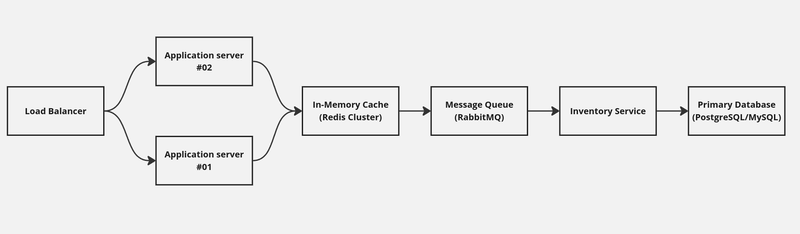

# Part 2 - System Design:

## Your system needs to handle flash sales events where 100,000 customers might try to purchase the same limited-stock item simultaneously. Design a solution that prevents overselling, maintains system stability, & ensures fair order processing.

### Architecture Design:

To tackle such events in a system, multiple key points must be taken into consideration:

1. **Load Balancers:** Distributes traffic across multiple application servers.

2. **Stateless Application Servers:** Handle business logic and API requests. These servers should be stateless to enable horizontal scaling.

3. **Cache:** Manages a distributed lock for inventory control and stores temporary data for high-speed access.

4. **Database (RDBMS):** Maintains the inventory, order details, and user data. Employ a highly available and scalable database. The choice of RDBMS over a NoSQL database for handling flash sales is primarily due to the specific requirements of the system, such as strict consistency, complex transactions, and relational data dependencies.

5. **Message Queue:** Handles order requests asynchronously to process them sequentially and reduce application load.

6. **Inventory Service:** A dedicated service to manage inventory updates and ensure consistency.

7. **Monitoring & Logging:** Tracks system health and detects bottlenecks.

### Architecture Diagram:

### Technology Choices:

1. **Load Balancer:** AWS Elastic Load Balancer (ELB); The reason behind choosing AWS is the ensure os stability.
2. **Application Servers:** Node.js, Django, or Spring Boot for scalability and high performance.
3. **In-Memory Cache:** Redis for distributed locks and high-speed data access.
4. **Database:** PostgreSQL or MySQL with a strong consistency model.
5. **Message Queue:** RabbitMQ for order queuing.
6. **Monitoring:** Prometheus, Grafana, and ELK stack for logs and performance monitoring.

### Scaling Strategy:

1. **Application Servers:** Use horizontal scaling with auto-scaling groups to handle traffic spikes.
2. **In-Memory Cache:** Deploy a Redis cluster with sharding for high availability and scalability.
3. **Database:**
    - Use read replicas for read-heavy operations.
    - Partition tables for large datasets.
4. **Message Queue:** Scale consumers dynamically based on the number of messages in the queue.

### Potential Bottlenecks and Solutions:

1. **Database Overload:**
    - **Solution:** Use read replicas for queries and caching for frequently accessed data.
2. **Message Queue Overload:**
    - **Solution:** Increase the number of consumers and use partitioning in Kafka.
3. **Cache Saturation:**
    - **Solution:** Use a Redis cluster and evict non-critical data during peak events.
4. **Lock Contention:**
    - **Solution:** Use fine-grained locks (e.g., per item) to reduce contention.

### Conclusion:

This system design provides a robust solution to handle high-concurrency flash sales, ensuring seamless user experience and system stability. By utilizing distributed architecture with stateless application servers, in-memory caching with Redis for locking, and an ACID-compliant RDBMS for inventory consistency, the design effectively prevents overselling and preserves data integrity. Asynchronous processing through message queues ensures fair order handling, while horizontal scaling and advanced monitoring tools like Prometheus and Grafana address traffic spikes and bottlenecks. Together, these components create a scalable, efficient, and reliable solution for managing flash sale events.